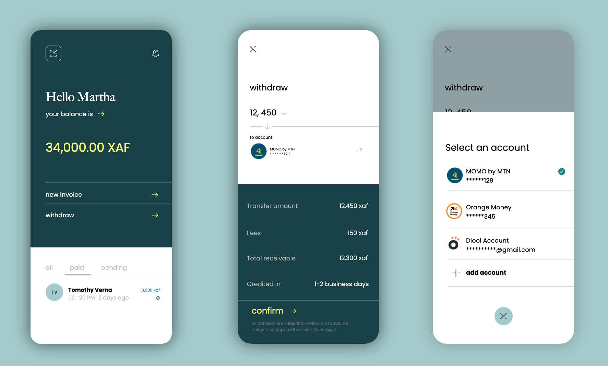

<!-- Improved compatibility of back to top link: See: https://github.com/othneildrew/Best-README-Template/pull/73 -->

<a name="readme-top"></a>

<!--
*** Thanks for checking out the Best-README-Template. If you have a suggestion
*** that would make this better, please fork the repo and create a pull request
*** or simply open an issue with the tag "enhancement".
*** Don't forget to give the project a star!
*** Thanks again! Now go create something AMAZING! :D
-->

<!-- PROJECT SHIELDS -->
<!--
*** I'm using markdown "reference style" links for readability.
*** Reference links are enclosed in brackets [ ] instead of parentheses ( ).
*** See the bottom of this document for the declaration of the reference variables
*** for contributors-url, forks-url, etc. This is an optional, concise syntax you may use.
*** https://www.markdownguide.org/basic-syntax/#reference-style-links
-->

<!-- PROJECT LOGO -->
<br />
<div align="center">
  <a href="https://github.com/othneildrew/Best-README-Template">
    
  </a>

  <h1 align="center">Nkolo</h1>

  <p align="center">
    A fullstack invoices application for smalll businesses, built with Java, Firebase, Node, Express and React.  
    <br />
    <a href="https://www.thisisjames.xyz/#portfolio"><strong>View on the web »</strong></a>
    <br />
    <br />
    <a href="https://www.thisisjames.xyz/#portfolio">Download APK</a>
    ·
    <a href="https://github.com/JamesNjong/Nkolo">Report Bug</a>
    ·
    <a href="https://github.com/JamesNjong/Nkolo">Request Feature</a>
  </p>
</div>

<!-- TABLE OF CONTENTS -->
<details>
  <summary>Table of Contents</summary>
  <ol>
    <li>
      <a href="#about-the-project">About The Project</a>
      <ul>
        <li><a href="#built-with">Built With</a></li>
      </ul>
    </li>
    <li>
      <a href="#getting-started">Getting Started</a>
      <ul>
        <li><a href="#prerequisites">Prerequisites</a></li>
        <li><a href="#installation">Installation</a></li>
      </ul>
    </li>
    <li><a href="#usage">Usage</a></li>
    <li><a href="#roadmap">Roadmap</a></li>
    <li><a href="#contributing">Contributing</a></li>
    <li><a href="#license">License</a></li>
    <li><a href="#contact">Contact</a></li>
    <li><a href="#acknowledgments">Acknowledgments</a></li>
  </ol>
</details>

<!-- ABOUT THE PROJECT -->

## About The Project

  <a href="https://github.com/othneildrew/Best-README-Template">
    
  </a>

Nkolo was built as a low cost alternative to merchant codes for small businesses.

This app has three major components:

- <strong>Rest API (MongoDB, Node and Express via Render)</strong> The assessments present in the app are a series of questions scrapped from linkedin (not by us) stored in mongodb. We then build a rest api to make these available on demand using a series of endpoints that provide a list of assessments, or a block of questions for a single subject.

- <strong> Android App (Kotlin) </strong> The Podium app on android is a built with Kotlin and android views and consumes the Podium API using the Moshi library. The app uses a MVVM architechure and pulls the assessments data into a LiveData object which is then attached to a recyclerview and made available to users. Custom loader library is used to provide a more fancy alternative to android progress bars. (V.1.0.0 has a very loose network layer, we do not check for connectivity until an api request fails. . .just laziness but yea, coming in future versions)

- <strong>Podium Web (React, Angular, Tailwind, Sass-) </strong> The podium apps on the web provides to users a means to take assessments or create them. Next on the road map . . . the platform for creating assessments will be built with angular.

<p align="right">(<a href="#readme-top">back to top</a>)</p>

### Built With

Here is a list major frameworks/libraries and technologies used to build this project.

- Kotlin
- Node
- Express
- MongoDB
- [![React][React.js]][React-url]
- [![Angular][Angular.io]][Angular-url]
- [![Bootstrap][Bootstrap.com]][Bootstrap-url]

<p align="right">(<a href="#readme-top">back to top</a>)</p>

<!-- GETTING STARTED -->

## Getting Started

If you are interested on building on this project, you would need either android studio with the most recent version of gradle or you could contribute by building the backend or web version. Feel free to clone the project and go from there. . .

To get a local copy up and running follow these simple example steps.

### Prerequisites

This is an example of how to list things you need to use the software and how to install them.

- npm
  ```sh
  npm install npm@latest -g
  ```

### Installation

_Below is an example of how you can instruct your audience on installing and setting up your app. This template doesn't rely on any external dependencies or services._

1. Get a free API Key at [https://www.thisisjames.xyz](https://www.thisisjames.xyz)

2. Clone the repo
   ```sh
   git clone https://github.com/JamesNjong/Podium
   ```
3. Install NPM packages
   ```sh
   npm install
   ```
4. Enter your API in `config.js`
   ```js
   const API_KEY = "ENTER YOUR API";
   ```

<p align="right">(<a href="#readme-top">back to top</a>)</p>

<!-- ROADMAP -->

## Roadmap

- [x] Include markdown editor in android app
- [x] Add support for images in questions
- [ ] Create web applications
- [ ] Create a system for generatins API Keys
- [ ] Create Web Applications
  - [ ] For students (general)
  - [ ] For teachers

See the [open issues](https://github.com/JamesNjong/Podium/) for a full list of proposed features (and known issues).

<p align="right">(<a href="#readme-top">back to top</a>)</p>

<!-- CONTRIBUTING -->

## Contributing

Contributions are what make the open source community such an amazing place to learn, inspire, and create. Any contributions you make are **greatly appreciated**.

If you have a suggestion that would make this better, please fork the repo and create a pull request. You can also simply open an issue with the tag "enhancement".
Don't forget to give the project a star! Thanks again!

1. Fork the Project
2. Create your Feature Branch (`git checkout -b feature/AmazingFeature`)
3. Commit your Changes (`git commit -m 'Add some AmazingFeature'`)
4. Push to the Branch (`git push origin feature/AmazingFeature`)
5. Open a Pull Request

<p align="right">(<a href="#readme-top">back to top</a>)</p>

<!-- LICENSE -->

## License

Distributed under the MIT License. See `LICENSE.txt` for more information.

<p align="right">(<a href="#readme-top">back to top</a>)</p>

<!-- CONTACT -->

## Contact

James J. Njong - [thisisjames.xyz](https://www.thisisjames.xyz)

Project Link: [https://github.com/JamesNjong/Podium](https://github.com/JamesNjong/Podium)

<p align="right">(<a href="#readme-top">back to top</a>)</p>

<!-- ACKNOWLEDGMENTS -->

## Acknowledgments

We use a couple of libraries to make the android app feel different. Also checkout storyset.com for the illustrations used in this project. And ofcause stackoverflow.

- [Circular Progress Indicator](https://github.com/antonKozyriatskyi/CircularProgressIndicator)
- [Dot Progress Indicator](https://github.com/tommybuonomo/dotsindicator)

<p align="right">(<a href="#readme-top">back to top</a>)</p>

<!-- MARKDOWN LINKS & IMAGES -->
<!-- https://www.markdownguide.org/basic-syntax/#reference-style-links -->

[contributors-shield]: https://img.shields.io/github/contributors/othneildrew/Best-README-Template.svg?style=for-the-badge
[contributors-url]: https://github.com/othneildrew/Best-README-Template/graphs/contributors
[forks-shield]: https://img.shields.io/github/forks/othneildrew/Best-README-Template.svg?style=for-the-badge
[forks-url]: https://github.com/othneildrew/Best-README-Template/network/members
[stars-shield]: https://img.shields.io/github/stars/othneildrew/Best-README-Template.svg?style=for-the-badge
[stars-url]: https://github.com/othneildrew/Best-README-Template/stargazers
[issues-shield]: https://img.shields.io/github/issues/othneildrew/Best-README-Template.svg?style=for-the-badge
[issues-url]: https://github.com/othneildrew/Best-README-Template/issues
[license-shield]: https://img.shields.io/github/license/othneildrew/Best-README-Template.svg?style=for-the-badge
[license-url]: https://github.com/othneildrew/Best-README-Template/blob/master/LICENSE.txt
[linkedin-shield]: https://img.shields.io/badge/-LinkedIn-black.svg?style=for-the-badge&logo=linkedin&colorB=555
[linkedin-url]: https://linkedin.com/in/othneildrew
[product-screenshot]: images/screenshot.png
[Next.js]: https://img.shields.io/badge/next.js-000000?style=for-the-badge&logo=nextdotjs&logoColor=white
[Next-url]: https://nextjs.org/
[React.js]: https://img.shields.io/badge/React-20232A?style=for-the-badge&logo=react&logoColor=61DAFB
[React-url]: https://reactjs.org/
[Vue.js]: https://img.shields.io/badge/Vue.js-35495E?style=for-the-badge&logo=vuedotjs&logoColor=4FC08D
[Vue-url]: https://vuejs.org/
[Angular.io]: https://img.shields.io/badge/Angular-DD0031?style=for-the-badge&logo=angular&logoColor=white
[Angular-url]: https://angular.io/
[Svelte.dev]: https://img.shields.io/badge/Svelte-4A4A55?style=for-the-badge&logo=svelte&logoColor=FF3E00
[Svelte-url]: https://svelte.dev/
[Laravel.com]: https://img.shields.io/badge/Laravel-FF2D20?style=for-the-badge&logo=laravel&logoColor=white
[Laravel-url]: https://laravel.com
[Bootstrap.com]: https://img.shields.io/badge/Bootstrap-563D7C?style=for-the-badge&logo=bootstrap&logoColor=white
[Bootstrap-url]: https://getbootstrap.com
[JQuery.com]: https://img.shields.io/badge/jQuery-0769AD?style=for-the-badge&logo=jquery&logoColor=white
[JQuery-url]: https://jquery.com
[kotlin-url]: https://kotlinlang.org
